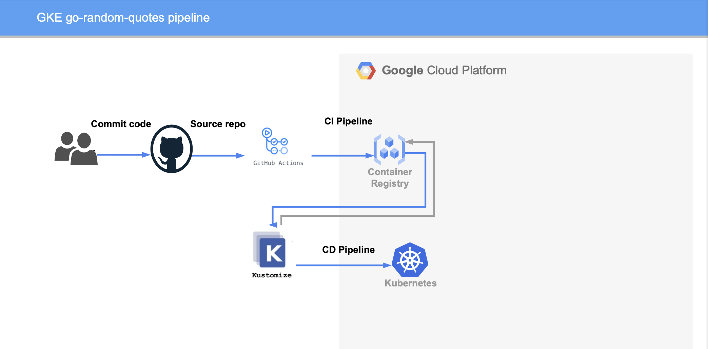

# go-random-quotes


In a nutshell, this pipeline job is created using Github Action which holds some jobs such as building, pushing, and deployment of simple applications to GKE. The build and push image process uses Google's container registry service (GCR). Furthermore, the deployment process is assisted by Kustomize, which is one of the CLI that is useful for maintaining Kubernetes configuration (Kubernetes Object) declaratively.

### Prerequisites 
```
- Github Action Pipeline
- Golang Service
- Google Container Registry (GCR)
- Google Kubernetes Engine (GKE)
- Gcloud CLI
- Helm Chart (optional)
- Cloudflare (optional)
```